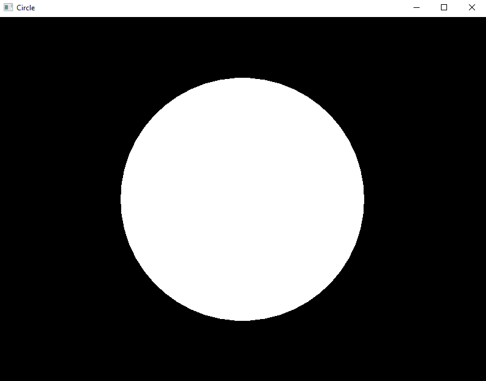

# Rust Circle Rendering with Open GL and SDL2

  

In this repository I have created a simple program that launches a new Window that renders a circle using Open GL and SDL 2 with the Rust Programming Language.

All my code has been annotated to show every step of the way. Code was written in VS Code.

RAYLIB BRANCH IS BETTER

link to crates, open gl and sdl2;

SDL2:
https://github.com/Rust-SDL2/rust-sdl2

Open GL:
https://github.com/brendanzab/gl-rs/

Crates:
https://crates.io/crates/gl
https://crates.io/crates/sdl2

# Screenshot

